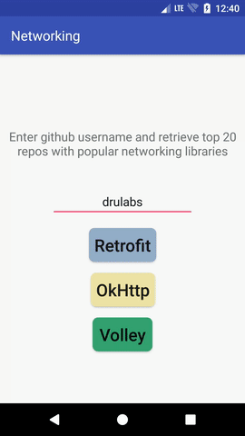

# Networking with popular libraries using Kotlin

This project is written in Kotlin to showcase REST communication with popular networking libraries (retrofit, volley and okhttp).

MVP has been used in this app, usage of dependency injection framework like dagger2 is highly recommended (currently not used).

Recycler view is used to display a list of user’s github repositories. Recycler view, adapter, view holder all in Kotlin.

## Minimum Requirements

 * Android Studio 3.0 Canery 3
 * Kotlin compiler and runtime version 1.1.2-4
 * Android SDK Platform 26 (android-O)
 * Android sdk tools 26.0.2
 * Android sdk build-tools 26.0.0
 * Android sdk plateform-tools 26.0.0
 
Networking & Recycler view

