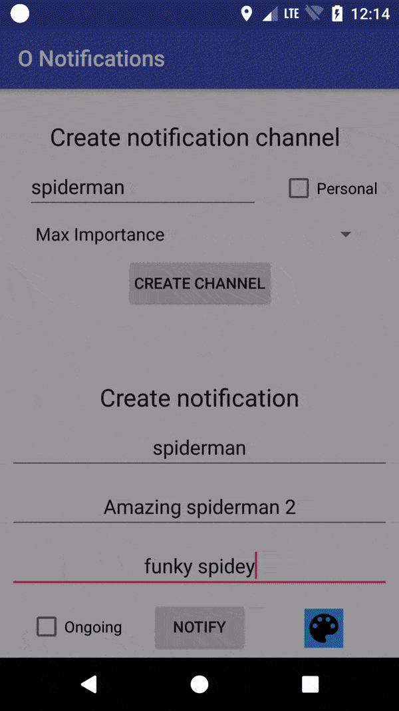

# Android-O Notifications With Kotlin

This project is written in kotlin to display usage new notification manager features to support android-O.

MVP has been used in this app, usage of dependency injection framework like dagger2 is highly recommended:

This creates 2 notification channel groups when presenter (NotificationPresenter) starts: “Personal” and “Business”

## Minimum Requirements

 * Android Studio 3.0 Canery 3
 * Kotlin compiler and runtime version 1.1.2-4
 * Android SDK Platform 26 (android-O)
 * Android sdk tools 26.0.2
 * Android sdk build-tools 26.0.0
 * Android sdk plateform-tools 26.0.0
 
Android-O Notifications

